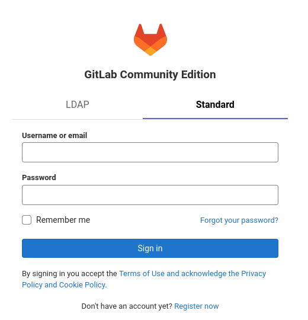
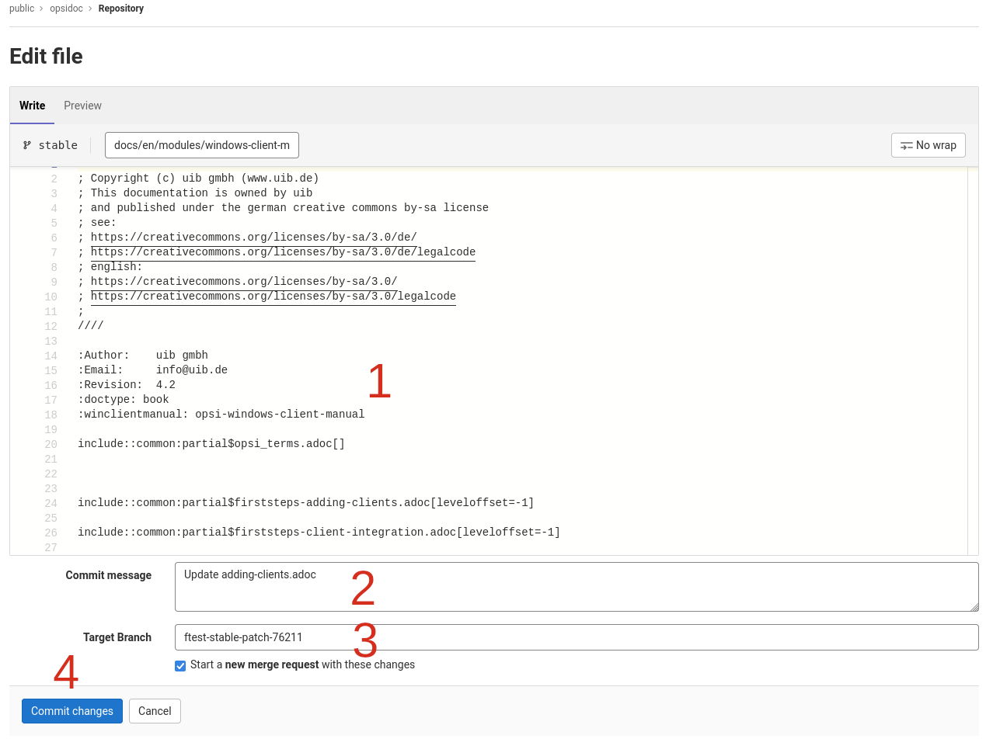
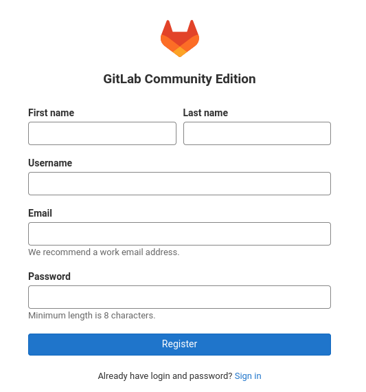
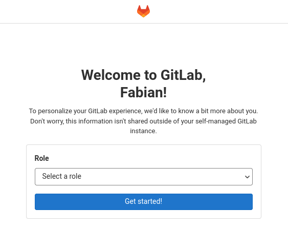
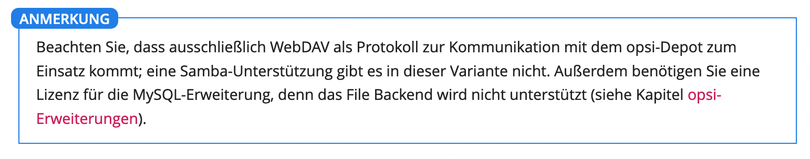
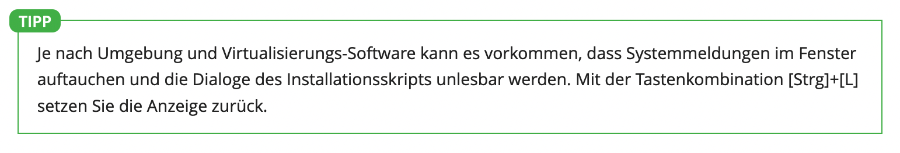
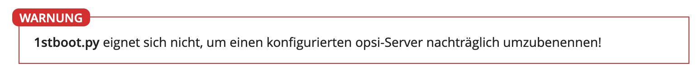

# Documentation for opsi

This is the source of the official documentation for the open source client management solution [opsi](https://www.opsi.org/).

The documentation is published on the website [https://docs.opsi.org](https://docs.opsi.org/).

PDF and HTML manuals can be found [here](https://download.uib.de/opsi4.2/documentation/).


## Edit this documentation

There are two main ways to edit the documentation:
1) Via the edit link on [docs.opsi.org](https://docs.opsi.org).
2) Clone this repository, edit the files locally
and create a Merge Request/Pull Request (gitlab.uib.de or github).

### Edit via docs.opsi.org
<a name="edit-docs"></a>

1) To Start go to [docs.opsi.org](https://docs.opsi.org) and click `Edit this Page` on the right of the page you want to edit.


2) You will get to https://gitlab.uib.de. To edit the docs you have to sign in (Standard) or create an account (see [create an account on gitlab.uib.de](#create-account)).



3) After logging in, the Gitlab editor opens.


- (1) Make your changes here.
- (2) Append a meaningfull commit message.
- (3) A branch name is automatically assigned and a merge request is created.
- (4) With 'Commit changes' your changes are saved and the merge request is created.
- A uib staff member then looks at the merge request and transfers the changes to the stable branch.

### Create an account on gitlab.uib.de
<a name="create-account"></a>

1) Click "Register now" and fill out your information.



2) Now your account must be approved. This is a manual step. So it can take some time.
3) When your account is approved you will recieve an email. Now you can sign in on gitlab.uib.de.
4) Select a Role for yourself, e.g., developer.



5) Now you can edit the opsidocs repository. Go back to [docs.opsi.org](https://docs.opsi.org). See [Edit via docs.opsi.org](#edit-docs).


## How to build an opsi manual (Antora and HTML/PDF)

To build the documentation files you can use the Visual Studio Code Dev Container.
In the Dev Container you can execute the different scripts to create the Antora site and the HTML/PDF manuals or you can use the VS Code tasks.

### Create Antora site

To create the Antora site with your local changes use the VS Code task or execute:

```shell
npx antora --log-level=debug local-playbook.yml
```

### Create PDF/HTML documentation

To create the css files call the build_stylesheets.sh script.

dependencies:
- ruby, ruby-gems
- gem install compass
- gem install zurb-foundation
<!-- - gem install zurb-foundation  --version 4.3.2 -->

```shell
sh tools/build_stylesheets.sh
```
This will take the *conf/stylesheets/opsi.scss* and build the *conf/stylesheets/opsi.css*. Images used in the scss files should be in the folder *conf/stylesheets/images*. `create_docu.py` copies all images to *\<destination\>/opsi-css/* (location of the html file).

To modify the PDF theme edit conf/opsi-theme.yml.

The documentation then is built with the script `make-books.sh` in tools. This script uses Python 3.

```shell
./tools/make-books.sh -l <LANGUAGE> -m -n <DOCUMENT>
```

```shell
HELP

Usage: ./bin/makepdf [-c] [-d] [-h] [-l] [-m] [-n <manual|getting-started|releasenotes|windows-client-manual|linux-client-manual|macos-client-manual|opsi-script-manual|quickinstall|opsi-script-reference-card|supportmatrix>]

-h ... help
-l ... set language default is de
-e ... Set failure level to ERROR (default: FATAL)
-c ... clean the build/ directory (contains the pdf)
-d ... Debug mode, prints the book to be converted. Only in combination with -m and/or -n
-m ... Build all available manuals
-n ... Build manual <name>. Only in combination with -m
```

Examples:

```shell
./tools/make-books.sh -l en -m -n manual
```

### Checking for valid links

With the script `tools/check_links.py` the build documentation is scanned for broken links.
This script requires Python 3.

To use this script first build the documentation and then run the script. It will show what links are broken and in case there are links that can not be opened a non-zero exit-code will be returned.


## Accept changes from external

Changes made via docs.opsi.org generate a merge request on gitlab.uib.de.
Queries and discussions can take place via the GitLab interface on gitlab.uib.de.
If the changes are to be adopted, gitlab.uib.de is first entered as the second remote in the local opsidoc repository:

```shell
git remote add gitlab.uib.de git@gitlab.uib.de:pub/opsidoc.git
```

Then the merge to stable can be processed. Once everything has been merged, stable is pushed internally to gitlab.uib.gmbh.
The change is then automatically transferred to gitlab.uib.de and the merge request is automatically closed.


# Sprachführer deutsches Handbuch

Ein gutes Handbuch

* vermittelt Wissen,
* ist sprachlich-formal korrekt,
* hat einen für Fachliteratur passenden Stil,
* ist klar und verständlich.

Die Leser sollen nachvollziehen und verstehen können, was zu tun ist. Komplexe Sachverhalte werden Schritt für Schritt vermittelt. Lieber kurze Sätze als lange Sätze. Wir nutzen die direkte persönliche Leseransprache („Sie“). Das Handbuch vermeidet unnötige Anglizismen und Denglisch: „hochladen“ statt „uploaden“, „herunterladen“ statt „downloaden“ usw. Wiederkehrende Fachausdrücke werden einheitlich geschrieben.

## Rechtschreibung

Wir nutzen die neue Rechtschreibung, wie sie im Duden (28. Auflage, 2020) verzeichnet ist. Manchmal bietet der Duden zwei Schreibweisen an: die neue, reformierte Schreibweise und die früher gültige Schreibweise als Alternative.
Im Zweifelsfall folgen wir der Empfehlung des Dudens.

### cSpell
Für die Rechtschreibprüfung der Dokumentation wird [CSpell](https://cspell.org/) verwendet.
Die Konfiguration befindet sich in der Datei `cspell.json`.
Darüber hinaus gibt es eine Liste von Schreibweisen/Eigennamen im Verzeichnis `opsidoc/cspell`, die fortlaufend aktualisiert wird. CSpell ist in den VS Code Dev Container integriert und wird automatisch verwendet.

Es besteht die Möglichkeit Wörter bei der Rechtschreibprüfung zu ignorieren.
Hierfür verwendet man direkt in der Dokumentation Kommentare in der Form:
```
// cSpell:ignore <Wort1>,<Wort2>
```
Diese Kommentare sollten möglichst in der Nähe des zu ignorierenden Begriffs eingefügt werden.


CSpell kann auch abschnittsweise deaktiviert werden.
Das An- und Abschalten erfolgt über Kommentare in der folgenden Form:
```
// cSpell:disable
[source,toml]
----
[groups]
fileadmingroup = "opsifileadmins"
----
// cSpell:enable
```

## Kommasetzung

Gleichrangige Teilsätze, die durch „und“, „oder“ usw. verbunden sind, setzen ein Komma, um die Gliederung deutlicher zu machen:

```
Klicken Sie auf die Schaltfläche `OK`, und die Installation beginnt.
```

Auch bei Infinitiv- und Partizip-Sätzen setzen wir ein Komma:

```
Klicken Sie auf die Schaltfläche mit den drei Linien, um das Menü zu öffnen.

Um die Inventarisierung zu starten, klicken Sie auf den Button `OK`.

Darauf aufmerksam gemacht, hat der Hersteller das Produkt vom Markt genommen.
```

## Zusammengesetzte Begriffe (DE/EN)

Deutsch-englische Komposita nutzen einen Bindestrich:

* Kernel-Quellen
* Windows-Client (Linux-Client, macOS-Client)
* Windows-basiert
* Linux-kompatibel

Ein Bindestrich wird außerdem gesetzt, wenn zusammengesetzte Wörter sehr lang sind und dadurch schwer zu lesen sind:

* Mehrbenutzer-System
* Software-Inventarisierung

## Fachbegriffe/Fremdwörter

Fremdwörter sollten nur dann verwendet werden, wenn es keine passende deutsche Alternative gibt oder wenn es sich um einen feststehenden Fachbegriff handelt.

Es ist ok, "Button" anstelle von "Schaltfläche" und vice versa zu verwenden.

Englische Begriffe, die ins deutsche Handbuch übernommen werden, unterliegen den Regeln der deutschen Sprache:

* Substantive werden großgeschrieben: Loglevel, Debuglevel
* Genitiv von Fachbegriffen wird wie im Deutschen üblich mit „-s“ gebildet: des Clients, des Internets
* auch die Pluralbildung ist wie im Deutschen: Repositorys (nicht Repositories), Floppys (nicht Floppies) usw.
* zusammengesetzte Begriffe, die aus einem oder mehreren fremdsprachigen Wörtern und mindestens einem deutschen Wort bestehen, werden zusammengeschrieben bzw. mit Bindestrich: das Support-Paket, das Client-Management, die Software-Inventarisierung

## Eigennamen

Unsere Software heißt opsi (alles Kleinbuchstaben), und der Begriff wird genau so (auch am Satzanfang!) geschrieben.

## Maßeinheiten

Maßeinheiten werden wie im Duden geschrieben; es gibt kein Plural-s:

* Byte
* MByte
* GByte
* TByte

Zwischen einer Zahl und der Maßeinheit steht ein nicht-trennbares Leerzeichen (`{nbsp}`):

```
2{nbsp}GByte, 300{nbsp}GByte usw.
```

Das sieht dann so aus: 2&nbsp;GByte, 300&nbsp;GByte usw.

## Auflistungen

Es gibt nur einen einzigen Grund, nummerierte Aufzählungen zu verwenden: wenn es auf die Reihenfolge ankommt.

1. Klicken Sie auf die Schaltfläche `Installieren`.
2. Ein neuer Dialog öffnet sich; klicken Sie dort auf `OK`.

Alle anderen Auflistungen sind nicht nummeriert. Bei Auflistungen von Features oder Funktionen sollten die einzelnen Punkte möglichst einheitlich gestaltet sein (entweder ganze Sätze oder nicht, entweder mit Großbuchstaben beginnen oder nicht).

## Typografie

Ein nicht-trennbares (`{nbsp}`) Leerzeichen steht an folgenden Stellen:

* Abkürzungen z.&nbsp;B. (zwischen z. und B.), o.&nbsp;Ä., d.&nbsp;h.
* zwischen Ziffern und Maßeinheiten: 3&nbsp;GByte, 64&nbsp;Bit
* zwischen Auslassungspunkten … und dem vorangegangenen Wort: „Möglich ist das&nbsp;…“

Es gibt keinen Leerraum vor und nach einem Schrägstrich (DIN 5008): RHEL/AlmaLinux/Rocky Linux

## Farbige Kästen

Zur Auflockerung und zum Sichtbarmachen wichtiger Informationen nutzen wir die folgenden farbigen Kästen:

NOTE: Das hier ist eine Anmerkung, sie wird hinter `NOTE:` gesetzt



TIP: Das hier ist ein Tipp, er steht hinter `TIP:`



WARNING: Hier steht eine Warnung, sie steht hinter `WARNING:` (Achtung: Wir haben uns entschieden, nur WARNING und nicht auch noch CAUTION zu verwenden!)



## Schreibweisen und Hervorhebungen

Wir verwenden in diesem Handbuch die folgenden Schreibweisen und Hervorhebungen:

### Proportionalschrift (monospace)
In asciidoc werden Backticks (`` ` ``) verwendet um Text in Proportionalschrift darzustellen.
Proportionalschrift wird zur Hervorhebung der folgenden Elemente verwendet:

* Datei- und Verzeichnisnamen:
  * ``Die Host-ID ist in der Datei `/etc/opsi/opsi.conf` hinterlegt.``
* Befehle im Fließtext:
  * ``Führen Sie den Befehl `apt update` aus.``
* Befehls-Parameter:
  * ``Über den Parameter `--debug` schalten Sie in den Debug-Modus.``
* Menüeinträge und Beschriftungen von Schaltflächen und Eingabefeldern:
  * ``Wählen Sie auf den Menüeintrag `Sende Nachricht`.``
  * ``Klicken Sie auf `weiter`.``
  * ``Tragen Sie den Namen in das Feld `Hostname` ein.``
* Text der in Felder oder Dateien eingegeben wird:
  * ``Geben Sie den Wert `true` ein.``
  * ``Fügen Sie die Zeile `opsi-server   10.1.2.3` am Ende der Datei ein.``
* Kurze Befehls-Ausgaben:
  * ``Die Ausgabe `Version 4.3.0.1` erscheint.``
* Tasten und Tastenkombinationen:
  * ``Mit der Tastenkombination `[Strg]+[L]` setzen Sie die Anzeige zurück.``

### Fettgedruckte Schrift
In asciidoc werden Sternchen (``*``) verwendet um Text fett darzustellen.
Fettgedruckte Schrift wird zur Hervorhebung der folgenden Elemente verwendet:

* Eigennamen:
  * `opsi bietet mit dem *opsi-configed* ein komfortables Management Interface.`

### Code-Blöcke und Listings
Längere Befehle, Code-Auszüge und Datei-Inhalte stehen in eigenen Kästen.
Diese besitzen den folgenden Aufbau:
```
.Optionaler Titel
[source,<Typ>]
----
<text>
----
```
Gültige Typen sind beispielweise: `shell`, `bash`, `ini`, `xml`, `html`, `css`.

### Weitere Konventionen
* In `<spitzen Klammern>` stehen Bezeichnungen, die Sie durch ihre Bedeutung ersetzen müssen. So heißt die Dateifreigabe mit den opsi-Paketen z.&nbsp;B. `<opsi-depot-share>`. Auf einem realen Server liegt sie in der Regel in `/var/lib/opsi/depot`. Das Softwarepaket `<opsi-depot-share>/ooffice` befindet sich also unter `/var/lib/opsi/depot/ooffice`.
* Tasten und Tastenkombinationen stehen in eckigen Klammern, z.&nbsp;B. `[C]`, `[Strg]+[C]` usw.
* In Überschriften werden keine Text-Hervorhebungen verwendet.


